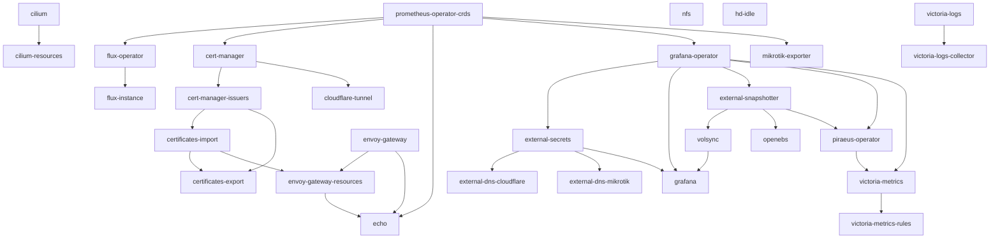

# Application Dependencies

This diagram shows Flux `Kustomization` application dependencies currently deployed from `clusters/dev/apps`.

Notes:

- This includes deployed application kustomizations referenced by `clusters/dev/apps/kustomization.yaml`.
- `frigate` is intentionally omitted because it is commented out in `kubernetes/apps/home-automaton/kustomization.yaml`.
